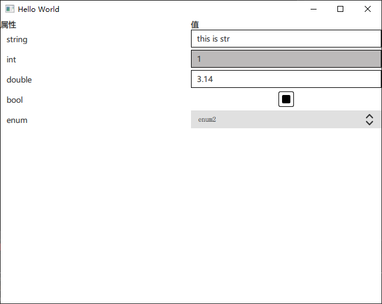

# 简单的qml 属性浏览器
基于quick2 TableView实现，主要思想是根据model type role 的数据确认该项的类型，
使用Loader分类别加载对应类型的组件（string、int、double、bool和enum）。  
我知道在Qt.labs.qmlmodels中有更好的delegateChoose可以使用，但在我知道之前我用Loader实现了此功能，
就这么着吧。不知道这2种方法谁更好。  
model在cpp里定义，用QQmlProperty将其设置为TableView model的值。  
以下是示例：  

